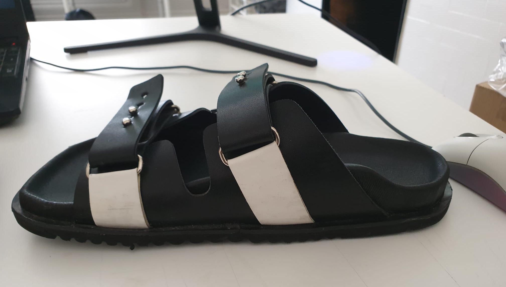

# URBNC3 - Custom Footwear Technology

## Revolutionary Custom Footwear Technology

[Urbnc3](https://urbnc3.com/) is a startup focusing on customized supportive footwear, where I am a Co-Founder.

Normal shoes have flat insoles - the same for everyone. Now when is the last time you met someone with the same foot as you? Never.
All feet are different and most of them would need individual support. In the past this was not possible, as individual adaptation required huge efforts and time of experts. With Urbnc3 this changed. We combine AI reconstruction with heuristic algorithms and 3D-Printing to offer the right support for every foot!

## Our Technology Process

### Step 1: Multi-Angle Image Capture
We take multiple photographs of your foot from different angles using our specialized mobile app:

### Step 2: 3D Foot Model Reconstruction
Using advanced AI algorithms, we reconstruct a precise 3D model of your foot from these multiple angle photographs. This creates an anatomically accurate digital representation of your unique foot structure.

### Step 3: Sole Feature Extraction & Insole Design
From the 3D foot model, our proprietary algorithms extract key sole features and create a posture-correcting supportive insole model in OBJ format. This model is optimized for both insoles and sandal soles.

### Step 4: 3D Printing with Elastic Materials
The final step involves 3D printing your custom insoles using specialized elastic materials that provide both comfort and support:

## Our Product Suite

**Private Customers**:
- Custom sandals with integrated supportive soles
- Custom insoles for existing footwear

**Business Customers**:
- API access to our scanning algorithm
- API access to our 3D-footmodel to insole algorithm
- The combination of both services

## My Technical Contribution

### The Tech Stack Revolution
Each pair designed by hand from the foot model took 4-5 hours prior to my algorithm. The algorithm I developed generates precise, anatomically accurate models in 1.5-2.5 seconds on a standard laptop. That is an improvement by about 4 orders of magnitude, or 10,000 times faster.

In the process of this I built:
- A custom 3D object library because existing solutions weren't good enough
- Mesh processing algorithms that maintain precision while being lightning fast
- Automated pipelines
- APIs
- And much more

### Real Results

- From 4-5 hours to 1.5-2.5 seconds per pair
- Better anatomical accuracy than traditional methods
- More comfortable than the orthopedic insoles I've tried
- Currently being tested with real customers

## The Complete Journey: From Photos to Custom Footwear

Our technology transforms simple smartphone photos into perfectly fitted, supportive footwear through a seamless four-step process that combines cutting-edge AI, advanced 3D modeling, and precision 3D printing technology.
